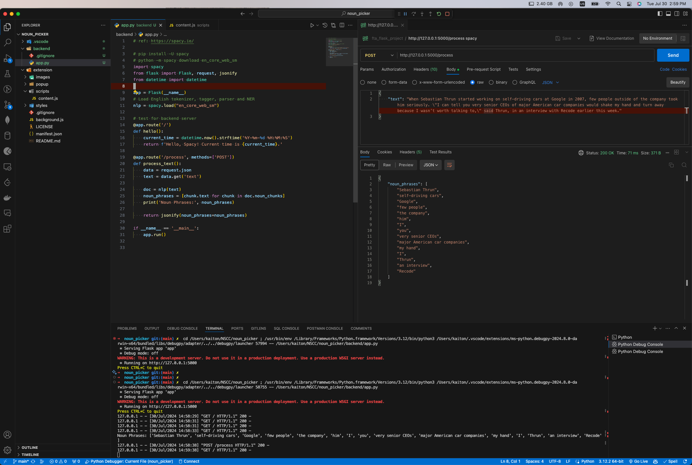
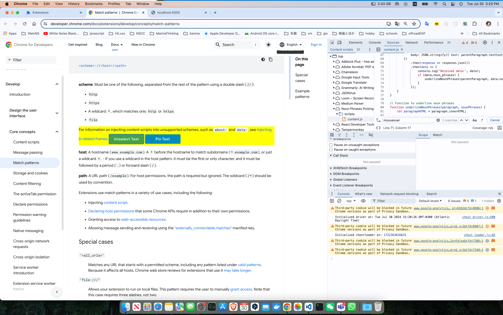
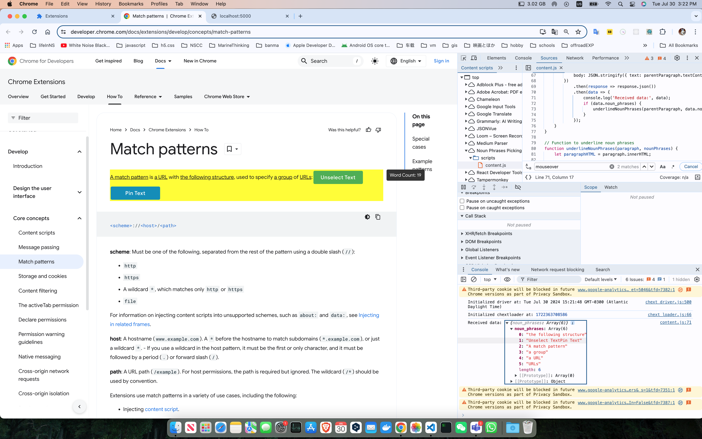
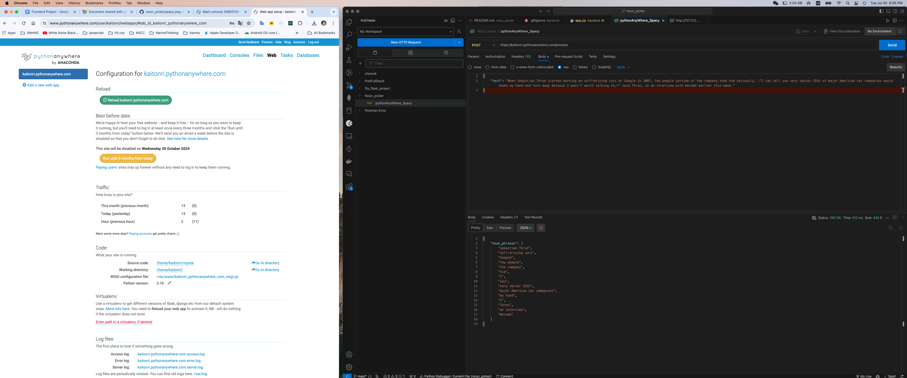
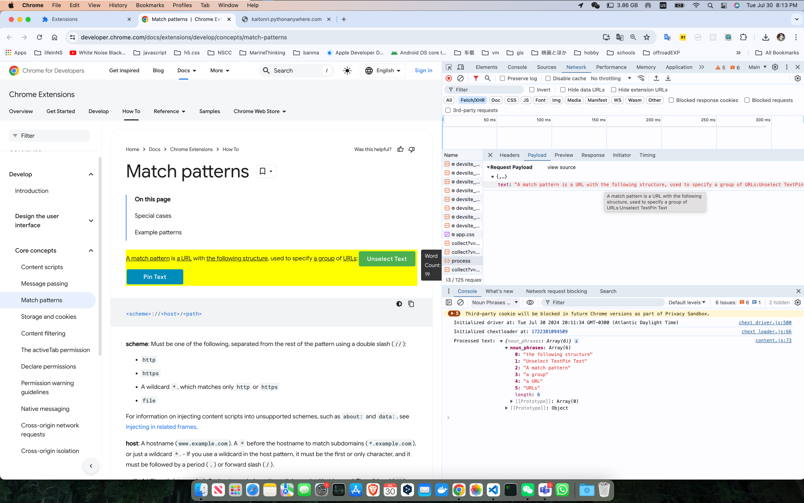

# noun_picker
A Chrome extension is used for highlighting noun phrases.

## Reference
- [Chrome Extension](https://developer.chrome.com/docs/extensions/get-started/tutorial/hello-world◊)
- [spacy model usage](https://spacy.io/usage)
- [spacy model demo](https://spacy.io)
- [PythonAnywhere](https://www.pythonanywhere.com/)

## Chrome Extension Installation
1. Clone the repository
2. Open Chrome and go to `chrome://extensions/`
3. Enable Developer mode
4. Click on `Load unpacked` and select the cloned repository
5. The extension is now installed

## Backend Installation
1. Install the dependencies, `spacy`, `flask`, and `flask_cors`
2. Run the backend server using `python3 app.py`
3. The server is now running on `http://localhost:5000`

## After setting up the extension and backend
1. pin the extension to the browser
2. Open a `https://developer.chrome.com/docs/extensions/*` page, and click on the extension icon
3. For example, load the extension on the `https://developer.chrome.com/docs/extensions/develop/concepts/match-patterns` page

## Screenshots

This is a sceenshot of testing the spacy model on the backend server.

This is a screenshot of selecting text on the browser.

This is a screenshot of the underline to the noun phrases on the browser.

This is a screenshot of the spacy model running on the pythonanywhere server.

Utilizing the spacy model on the pythonanywhere server to select text on the browser.